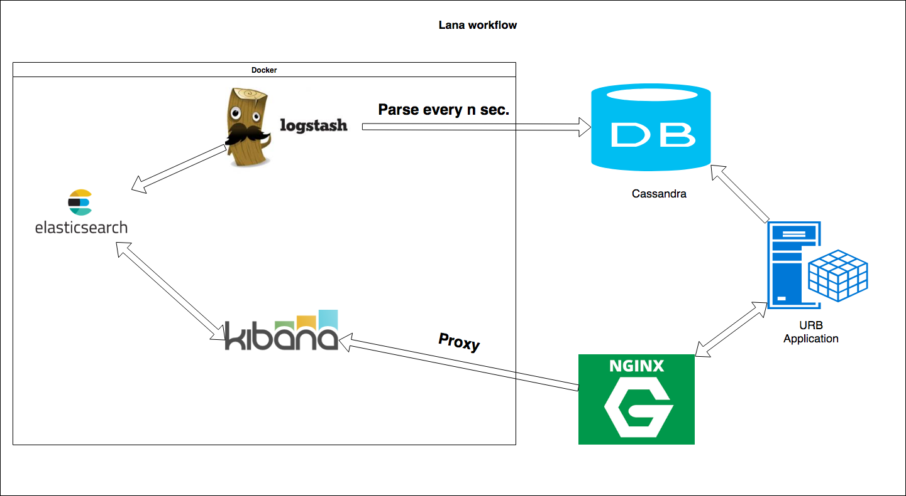

# Introduction

Lana is a project capable of providing analytics and visualization functionality for bots services websites.

## Software

### Elastic Search (ES)

    Es will be used to store domain entities (ES types):

* **Conversation Logs**

| Entity Name                | Description                                                         | Data Type |
| -------------------------- | ------------------------------------------------------------------- | --------- |
| ArtifactID                 | Identifies which instance of a bot does this conversation belong to | UUID      |
| ConversationID             | Foreign key to conversation metadata                                | UUID      |
| DateAndTime                | Time of conversation                                                | DateTime  |
| TextOfMessage              | TextOfMessage                                                       | String    |
| IntentVariables            |                                                                     |
| IntentCalculatedProperties |                                                                     |

* **Conversation Metadata**

| Entity Name             | Description                                                         | Data Type |
| ----------------------- | ------------------------------------------------------------------- | --------- |
| ArtifactID              | Identifies which instance of a bot does this conversation belong to | UUID      |
| ConversationID          | Foreign key to conversation logs                                    | UUID      |
| UserId                  | Foreign key to Users                                                | UUID      |
| DurationOfConversation  | Start of Conversation                                               | Number  |
| BeginningOfConversation | Beginning of Conversation                                           | DateTime  |
| EndOfConversation       | End of Conversation                                                 | DateTime  |
| ABTestingVariables      |                                                                     |

* **User Metadata**

| Entity Name   | Description                                                         | Data Type |
| ------------- | ------------------------------------------------------------------- | --------- |
| ArtifactID    | Identifies which instance of a bot does this conversation belong to | UUID      |
| Gender        | Gender                                                              | String    |
| Age           | Age                                                                 | Number    |
| Likes         | What they liked on facebook                                         | String    |
| Income        | Income                                                              | Number    |
| MaritalStatus | MaritalStatus                                                       | String    |
| Children      | Children                                                            | Number

---
### Lana Workflow




### Installation instructions (Ubuntu)

1. **Install Docker**
``` 
sudo apt-get update

sudo apt-get install \
    apt-transport-https \
    ca-certificates \
    curl \
    software-properties-common

    curl -fsSL https://download.docker.com/linux/ubuntu/gpg | sudo apt-key add -

sudo add-apt-repository \
   "deb [arch=amd64] https://download.docker.com/linux/ubuntu \
   $(lsb_release -cs) \
   stable"


sudo apt-get update

sudo apt-get install docker-ce
```

2. **Install Docker Compose**
```
sudo curl -L https://github.com/docker/compose/releases/download/1.20.1/docker-compose-$(uname -s)-$(uname -m) -o /usr/local/bin/docker-compose

sudo chmod +x /usr/local/bin/docker-compose
```

3. **Start Lana Analytics**
```
docker-compose up
```